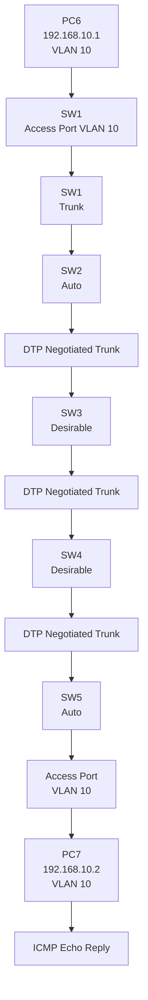

# 🧪 Dynamic Trunking Protocol (DTP) Lab

## 🎯 Objective

Build a multi-switch LAN using **Dynamic Trunking Protocol (DTP)** to understand how Cisco switches dynamically negotiate trunk links using **Auto** and **Desirable** modes.

The lab also demonstrates **802.1Q trunking**, VLAN 10 propagation, and end-to-end communication between PCs connected to different switches.

## 🖥️ Topology

```text
PC6 ─── SW1 ═══ SW2 ═══ SW3 ═══ SW4 ═══ SW5 ─── PC7
        Trunk   DTP     DTP     DTP     DTP
```
<br>
<br>

<br>
<br>
### DTP Interface Configuration

| Switch | Interface | DTP Mode  | Result         |
| ------ | --------- | --------- | -------------- |
| SW1    | Gi0/0     | Trunk     | Trunk          |
| SW2    | Gi0/0     | Auto      | Trunk with SW1 |
| SW2    | Gi0/1     | Desirable | Trunk with SW3 |
| SW3    | Gi0/0     | Auto      | Trunk with SW2 |
| SW3    | Gi0/1     | Desirable | Trunk with SW4 |
| SW4    | Gi0/0     | Desirable | Trunk with SW3 |
| SW4    | Gi0/1     | Desirable | Trunk with SW5 |
| SW5    | Gi0/0     | Auto      | Trunk with SW4 |

## 🌐 IP Addressing

| Device | IP Address   | Subnet Mask   | VLAN    |
| ------ | ------------ | ------------- | ------- |
| PC6    | 192.168.10.1 | 255.255.255.0 | VLAN 10 |
| PC7    | 192.168.10.2 | 255.255.255.0 | VLAN 10 |

## 🔧 Technologies

* Cisco IOS
* EVE-NG
* Dynamic Trunking Protocol (DTP)
* 802.1Q
* VLAN 10
* Ethernet
* IPv4
* ARP
* ICMP
* MAC Address Table

## ⚙️ DTP Configuration

### SW1 — Static Trunk

```cisco
interface gi0/0
 switchport mode trunk
 switchport trunk encapsulation dot1q
```

PC6 is connected to an access port configured for VLAN 10.

```cisco
interface gi0/1
 switchport mode access
 switchport access vlan 10
```
<br>
<br>


<br>
<br>

### SW2 — Auto and Desirable

```cisco
interface gi0/0
 switchport mode dynamic auto

interface gi0/1
 switchport mode dynamic desirable
```
<br>
<br>

<br>
<br>

### SW3 — Auto and Desirable

```cisco
interface gi0/0
 switchport mode dynamic auto

interface gi0/1
 switchport mode dynamic desirable
```
<br>
<br>


<br>
<br>

### SW4 — Desirable and Desirable

```cisco
interface gi0/0
 switchport mode dynamic desirable

interface gi0/1
 switchport mode dynamic desirable
```
<br>
<br>


<br>
<br>
### SW5 — Auto

```cisco
interface gi0/0
 switchport mode dynamic auto
```

PC7 is connected to an access port configured for VLAN 10.

```cisco
interface gi0/1
 switchport mode access
 switchport access vlan 10
```
<br>
<br>


<br>
<br>

## 🔄 DTP Negotiation

DTP allows neighboring Cisco switches to negotiate whether a link should operate as a trunk.

```text
SW1                    SW2
Trunk       ───────    Auto
             ↓
          TRUNK LINK
```

```text
SW2                    SW3
Desirable   ───────    Auto
             ↓
          TRUNK LINK
```

```text
SW3                    SW4
Desirable   ───────    Desirable
             ↓
          TRUNK LINK
```

```text
SW4                    SW5
Desirable   ───────    Auto
             ↓
          TRUNK LINK
```

### Important DTP Rule

| Side A    | Side B    | Result |
| --------- | --------- | ------ |
| Trunk     | Auto      | Trunk  |
| Trunk     | Desirable | Trunk  |
| Desirable | Auto      | Trunk  |
| Desirable | Desirable | Trunk  |
| Auto      | Auto      | Access |
| Auto      | Access    | Access |

## 🏷️ VLAN Configuration

VLAN 10 is configured on all switches.

```cisco
vlan 10
 name VLAN10
```

The PC-facing interfaces are configured as access ports:

```cisco
switchport mode access
switchport access vlan 10
```

The inter-switch links operate as **802.1Q trunk links**, allowing VLAN 10 traffic to travel across the switch network.

## 🔍 Verification


### Verify Connectivity

From PC6:

```text
ping 192.168.10.2
```

PC6 should successfully communicate with PC7.
<br>
<br>

<br>
<br>

## 📊 Communication Process

### VLAN 10 Communication Across DTP Trunks



## 📦 Frame Flow

```text
PC6
 ↓
Access Port VLAN 10
 ↓
SW1
 ↓
802.1Q Trunk
 ↓
SW2
 ↓
802.1Q Trunk
 ↓
SW3
 ↓
802.1Q Trunk
 ↓
SW4
 ↓
802.1Q Trunk
 ↓
SW5
 ↓
Access Port VLAN 10
 ↓
PC7
```

On the trunk links, the Ethernet frame carries the **802.1Q VLAN 10 tag**. When the frame reaches the destination access port, the switch sends it toward PC7 as an **untagged access-port frame**.

## 🔍 End-to-End Communication

1. PC6 wants to communicate with PC7.
2. Both PCs are in **VLAN 10** and the same IP subnet.
3. PC6 uses ARP to learn PC7's MAC address if it is not already known.
4. PC6 creates an Ethernet frame.
5. SW1 receives the frame on the VLAN 10 access port.
6. SW1 forwards VLAN 10 traffic through the trunk.
7. VLAN 10 traffic crosses SW2, SW3, SW4 and SW5 through the negotiated trunk links.
8. SW5 forwards the frame through the VLAN 10 access port.
9. PC7 receives the frame and sends an ICMP Echo Reply.
10. PC6 successfully receives the reply.

## ✅ Result

PC6 successfully communicated with PC7 across multiple Cisco switches using **DTP-negotiated trunk links** and **VLAN 10**.

The lab demonstrates how **Auto** and **Desirable** DTP modes dynamically negotiate trunking between neighboring Cisco switches.

## 📚 Key Learning

* Dynamic Trunking Protocol (DTP)
* Dynamic Auto mode
* Dynamic Desirable mode
* Static trunk mode
* 802.1Q trunking
* VLAN 10 propagation
* Access vs. trunk ports
* DTP negotiation between switches
* MAC address learning
* ARP
* ICMP
* End-to-end Layer 2 communication
